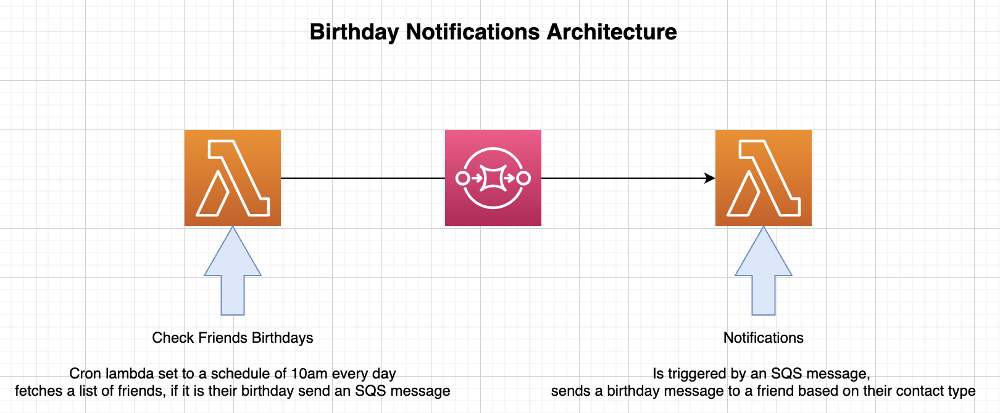

# Notifications

A service which fetches a list for friends, checks if it's their birthday. If it is, wishes them a happy birthday

# Architecture



# Getting Started

```
  git clone https://github.com/RichardWatkins1/notifcations.git
  cd notifcations
  yarn
```

# Running Specs

```
  yarn test
```

# Deployment

Deploys via The Severless framework

```
  yarn sls deploy
```

# Enhancements

1. Add a structured JSON logger e.g pino - https://github.com/pinojs/pino
2. Add schema validation to notification lambda for the incoming SQS message e.g https://ajv.js.org/
3. Add A way to capture exceptions e.g https://sentry.io/welcome/
4. Add CI/CD to build, lint, test and deploy code.
5. Add serverless-sqs-alarms-plugin and serverless-plugin-aws-alerts for raising cloudwatch alarms based on function errors or SQS queue lengths.
